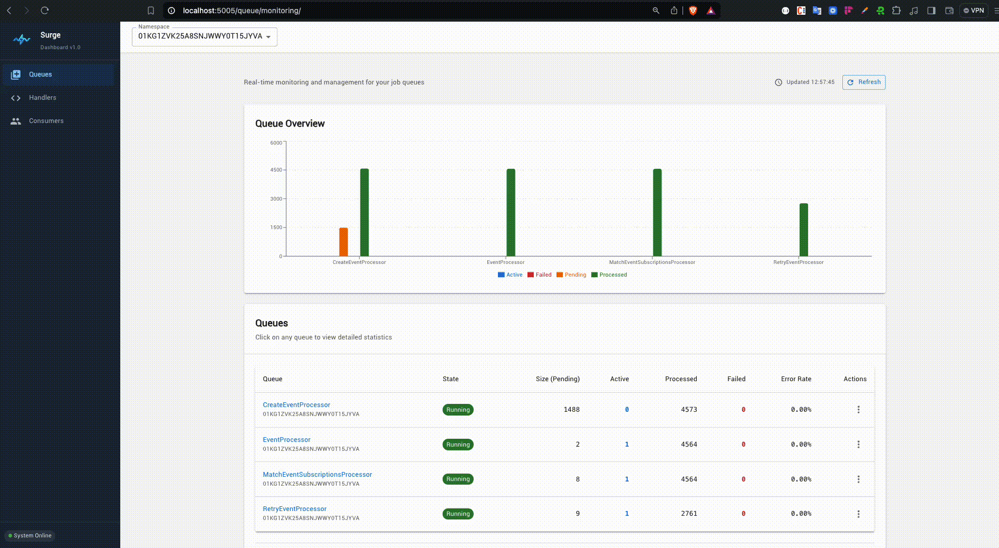

# Surge

**Production-grade distributed job queue for Go**

Surge is a distributed, in-memory job queue built specifically for Platform and SaaS teams. It comes with built-in multi-tenancy, real-time monitoring, and the reliability controls needed to scale to millions of jobs.

<p align="center">
  
</p>

## Features

- **Distributed Processing**: Horizontal scaling with multiple consumers
- **Priority Queues**: Fine-grained job prioritization (Critical → Low)
- **Namespaces**: Logical isolation of job queues
- **Scheduled Jobs**: Delay execution or schedule for specific times
- **Automatic Retries**: Exponential backoff with configurable limits
- **Dead Letter Queue (DLQ)**: Capture and retry failed jobs
- **Job Uniqueness**: Prevent duplicate job execution within time windows
- **Graceful Shutdown**: Clean worker termination with timeout controls
- **Recovery System**: Automatic detection and recovery of stuck jobs
- **Web Dashboard**: Real-time monitoring and management UI

## Quick Start

```go
package main

import (
    "context"
    "encoding/json"
    "log"

    "github.com/olamilekan000/surge/surge"
    "github.com/olamilekan000/surge/surge/config"
    "github.com/olamilekan000/surge/surge/job"
)

type SendEmail struct {
    To      string
    Subject string
    Body    string
}

func main() {
    ctx := context.Background()

    cfg := &config.Config{
        RedisHost:  "localhost",
        RedisPort:  6379,
        MaxWorkers: 50,
    }

    client, err := surge.NewClient(ctx, cfg)
    if err != nil {
        log.Fatal(err)
    }
    defer client.Close()

    client.Handle(SendEmail{}, func(ctx context.Context, job *job.JobEnvelope) error {
        var email SendEmail
        if err := json.Unmarshal(job.Args, &email); err != nil {
            return err
        }
        log.Printf("Sending email to %s: %s", email.To, email.Subject)
        return nil
    })

    // Enqueue a job to a namespace
    err = client.Job(SendEmail{
        To:      "user@example.com",
        Subject: "Welcome",
        Body:    "Thanks for signing up!",
    }).Ns("notifications").Enqueue(ctx)
    if err != nil {
        log.Fatal(err)
    }

    // Start consuming jobs
    if err := client.Consume(ctx); err != nil {
        log.Fatal(err)
    }
}
```

## Installation

```bash
go get github.com/olamilekan000/surge
```

## Documentation

For complete documentation, including configuration options, advanced features, best practices, and examples, see [docs.md](./docs.md).

## License

MIT License - see LICENSE file for details

## Support

- **Issues**: https://github.com/olamilekan000/surge/issues
- **Discussions**: https://github.com/olamilekan000/surge/discussions
